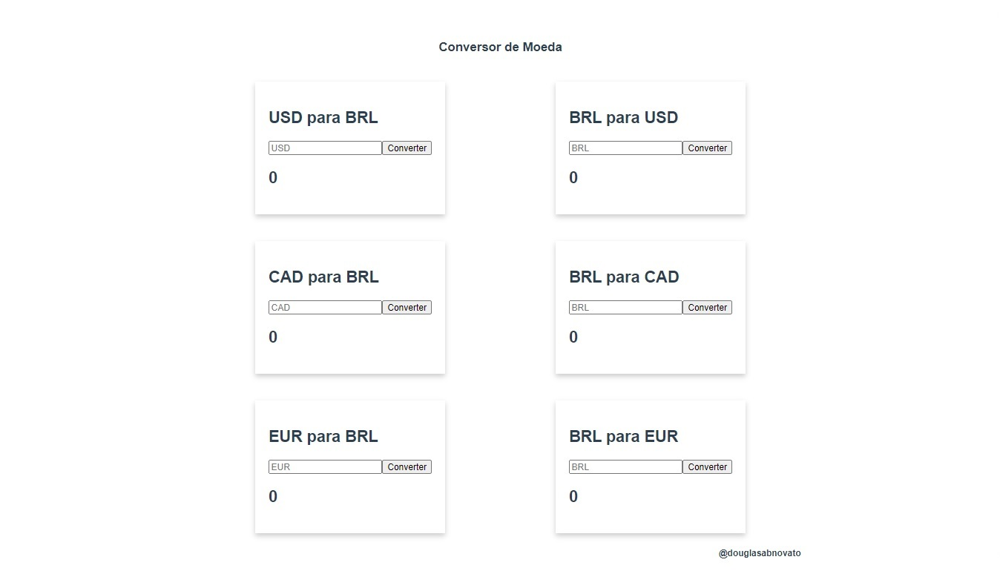

<h1 align="center">
    
</h1>

<h4 align="center"> 
	🚧 Conversor 🚀 em construção... 🚧
</h4> 

<p align="center">
  
  
  <a href="https://www.twitter.com/douglasabnovato/">
    
  </a>
</p>

## 💻 Sobre o projeto

♻️ Conversor

- Aplicação que consulta a API para conversões de moedas.
 
## 🎨 Layout

- [x] 1. Componentização com VueJS
- [x] 2. Estrutura HTML 
- [x] 3. Estilização CSS 
- [x] 4. Arquivos: `index.html`, `main.js`, `App.vue`, `Conversor.vue`

### Web - v1.0

<p align="center" style="display: flex; align-items: flex-start; justify-content: center;">
  
</p>

### Web - Próximo Passo 

- deploy da aplicação
- resposta da requisição

## 🛠 Tecnologias

As seguintes ferramentas foram usadas na construção do projeto:

- [Css][css]: posicionamento, dimensionamento e muito mais
- [Javascript][javascript]
- [HTML][html]: estrutura e efeitos 
- [VueJS][vuejs]:os fundamentos, como state, props, components, ciclo de vida.
- [Git][git]
- [Github][github]    
- API de conversão [Currency Converter API](https://free.currencyconverterapi.com/)
- https://free.currconv.com/api/v7/convert?q=USD_PHP&compact=ultra&apiKey=eb107cd1cb97803dad06

## 🚀 Como executar o projeto

Podemos considerar este projeto como sendo com uma parte:
1. Front End (pasta web)  

### Pré-requisitos

Antes de começar, você vai precisar ter instalado em sua máquina as seguintes ferramentas:
[Git](https://git-scm.com), [Node.js][nodejs]. 
Além disto é bom ter um editor para trabalhar com o código como [VSCode][vscode]

### 🧭 Rodando a aplicação web (Front End)

```bash 
# Clone este repositório
$ git clone https://github.com/douglasabnovato/conversor

# Acesse a pasta do projeto no seu terminal/cmd
$ cd conversor 

# se, Criar uma nova aplicação com vue
$ vue conversor

# Instale as dependências
$ node lts: v12.18.3
$ npm lts: v6.14.6
$ npm install vue
$ vue cli: `npm install --global @vue/cli`  
$ vue --version: @vue/cli 4.3.1


# Execute a aplicação em modo de desenvolvimento
$ npm run serve
$ npx browserslist --update-db
$ npm install vue-template-compiler

# A aplicação será aberta na porta:3000 - acesse http://localhost:8080   

```

## 😯 Como contribuir para o projeto

1. Faça um **fork** do projeto.
2. Crie uma nova branch com as suas alterações: `git checkout -b my-feature`
3. Salve as alterações e crie uma mensagem de commit contando o que você fez: `git commit -m "feature: My new feature"`
4. Envie as suas alterações: `git push origin my-feature`
> Caso tenha alguma dúvida confira este [guia de como contribuir no GitHub](https://github.com/firstcontributions/first-contributions)


## 📝 Licença

Este projeto esta sobe a licença MIT.

Feito com ❤️ por Douglas A B Novato 👋🏽 [Entre em contato!](https://www.linkedin.com/in/douglasabnovato/)

[git]: https://git-scm.com/doc
[github]: https://docs.github.com/en
[nodejs]: https://nodejs.org/
[typescript]: https://www.typescriptlang.org/
[expo]: https://expo.io/
[reactjs]: https://reactjs.org
[vuejs]: https://vuejs.org/
[rn]: https://facebook.github.io/react-native/
[yarn]: https://yarnpkg.com/
[vscode]: https://code.visualstudio.com/
[vceditconfig]: https://marketplace.visualstudio.com/items?itemName=EditorConfig.EditorConfig
[license]: https://opensource.org/licenses/MIT
[vceslint]: https://marketplace.visualstudio.com/items?itemName=dbaeumer.vscode-eslint
[prettier]: https://marketplace.visualstudio.com/items?itemName=esbenp.prettier-vscode
[rs]: https://rocketseat.com.br 
[css]: https://developer.mozilla.org/en-US/docs/Web/CSS 
[html]: https://developer.mozilla.org/en-US/docs/Web/HTML
[javascript]: https://developer.mozilla.org/en-US/docs/Web/JavaScript 

Fonte do projeto: [Programador BR](https://www.youtube.com/watch?v=tIEa3MRBpI0)